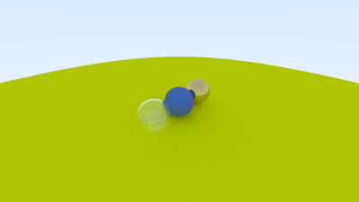
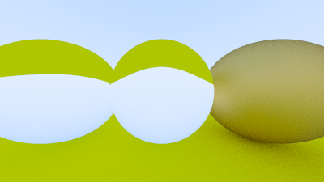

RTW 1

Creating First Image

Learnt about PPM and bitmaps

{width=2.6666666666666665in
height=2.6666666666666665in}

Image 1

Added process indicator and created the same PPM image

{width=2.6666666666666665in
height=2.6666666666666665in}

Image 2

Learnt about vectors after this, colors and how numbers indicate colors

Create a ray class and printed a blue to white gradient

Added a sphere to the diagram

(Surprisingly learning math in classes helped finally)

{width=4.166666666666667in
height=2.341666666666667in}

Image 3: Sphere and a BG

Continued with surface-normals.

Created a ray_color class and hit_shere class to detect if any ray hits
the sphere.

{width=4.166666666666667in
height=2.341666666666667in}

Image 4: Colored sphere according to the surface-normals

Proceeded to add function to check for hittable objects

Then learnt some fancy Cpp codes and pointers and weird codes

After this added antialiasing and learnt a lot about random numbers. The
mt19937 generator is quite amazing for how fast it works and then
imposing those values on a uniform distribution makes quiet a lot of
variation in numbers.

Learnt about diffusing materials.

After that made a sphere with gamma correction and added Lambertian
effect.

Metals are very confusing because they can reflect. And yeah that will
annoy you. Because scattering and reflectance have a very different
meaning. NCERT physics at point feels hopeless

The went to the refraction part and that was fun, somehow trigonometry
for it wasn't that confusing. And also added the total internal
reflection part weirdly enough these seemed much easier after learning
all that stuff before.

{width=4.166666666666667in
height=2.341666666666667in}{width=4.166666666666667in
height=2.341666666666667in}{width=4.166666666666667in
height=2.341666666666667in}{width=4.166666666666667in
height=2.341666666666667in}{width=4.166666666666667in
height=2.341666666666667in}{width=4.166666666666667in
height=2.341666666666667in}{width=4.166666666666667in
height=2.341666666666667in}{width=4.166666666666667in
height=2.341666666666667in}{width=4.166666666666667in
height=2.341666666666667in}{width=4.166666666666667in
height=2.341666666666667in}{width=4.166666666666667in
height=2.341666666666667in}{width=4.166666666666667in
height=2.341666666666667in}{width=4.166666666666667in
height=2.341666666666667in}{width=4.166666666666667in
height=2.341666666666667in}{width=4.166666666666667in
height=2.341666666666667in}

Then learnt about defocus blur and for guy who is just in college this
blew my mind. This is amazing for what it can do.

{width=4.166666666666667in
height=2.341666666666667in}

It can make those spheres like this. This looks amazing.

And do go and read about Gaussian noise and Perlin noise from Wikipedia
and what some videos from YouTube about it. They are absolutely amazing.
Intelligent, literally. The random numbers play a huge role in it.
(Pseudo random numbers)

Then we create a final render and man this took quite a lot time to
render but it's beautiful.

{width=6.268055555555556in
height=3.529166666666667in}

FINAL RENDER

All credits goes to the authors of Ray Tracing In A Weekend

[_Ray Tracing in One Weekend_](https://raytracing.github.io/books/RayTracingInOneWeekend.html)
